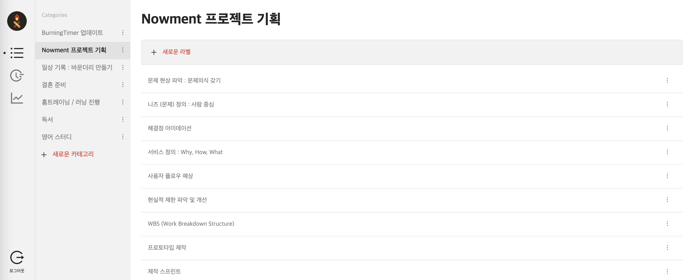
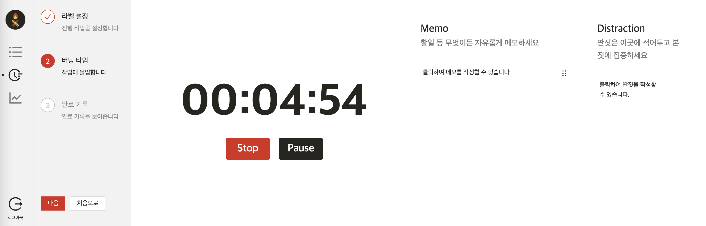
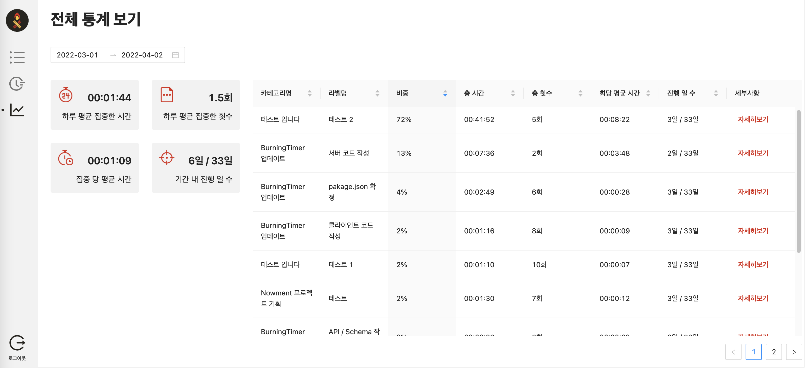

# BurningTimer-client

버닝타이머 : https://burningtimer.com/

오늘 하루 내가 무엇을 해냈는지, 얼마나 집중했는지 알고 계신가요?
중요한 일을 구분짓고, 집중하고, 리포트로 돌아보기 위해 만들었습니다.

---

### 중요한 일을 선정하세요.

중요한 일을 카테고리와 라벨로 관리하세요. 드래그하여 순서를 변경할 수도 있습니다.

### 타이머를 시작하세요.

어떤 작업을 했는지 자유롭게 메모하고, 집중을 방해하는 딴짓이 생각나면 따로 적어두고 나중에 확인하세요.

### 지난 나를 돌아보세요.

날짜를 설정하면 지난 기록을 확인할 수 있습니다. 카테고리와 라벨별로 구분되며, 더 세부적인 정보도 제공합니다.

## Skils
- React
- Storybook
- Emotion
- Ant Design

## Release Note
| Version | Release Date | Changes |
|--------|--------------|---------|
| v1.1.0  | 2022. 4. 10   | 웹브라우저 비활성화 시 타이머 멈춤 오류 수정 및 디자인 리뉴얼. |
| v1.0.0  | 2022. 1. 31   | 버닝타이머 제작 및 배포. |
